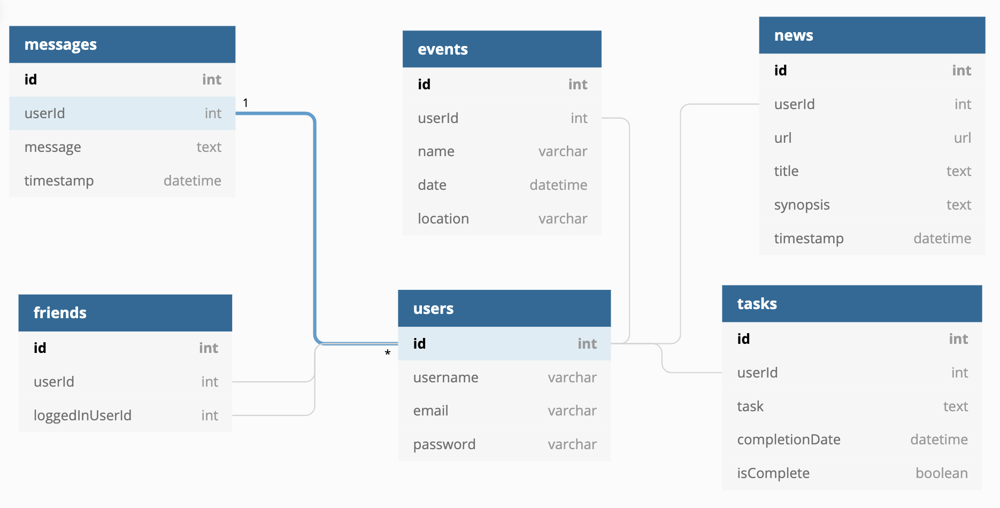

# Nutshell: README

A dashboard for people to use to organize their daily tasks, events, news articles, friends, and chat messages.

***

## Initialization Instructions
1. Install [http-server](https://www.npmjs.com/package/http-server) & json-server
    ```shell session
    $ npm install -g json-server
    ```
    
2. Select 'Clone or Download' in GitHub Repo, copy the SSH key, and type the following into your terminal:
    
    ex.
     ```shell session
    $ git clone git@github.com:nss-day-cohort-38/nutshell-keen-kit-kats.git

     ```
3. In the root directory, create an api directory and make a file 'database.json'
    ```shell session
    $ mkdir api
    $ cd api
    $ touch database.json
    ```
4. Then cd back to the root directory and open your code editor
    ```shell session
    $ code .
    ```
5. Open database.json and paste this into the file:
    ```json
        {
            "users": [],
            "messages": [],
            "friends": [],
            "news": [],
            "tasks": [],
            "events": []
        }
6. The database.json file follows the following ERD:
    

7. Go back to your terminal and open a new tab, cd to the src directory, then:
    ```shell session
    $ hs -o
    ```
8. Open another new tab in your terminal and cd to the api directory, then:
    ```shell session
    $ json-server -p 8088 -w database.json
    ```
***
## USING THE APP

### Sign Up or Log In

If you are a new user, click the 'sign up' button and enter a username, your email, and password.

If you are a returning user, click the 'log in' button and enter in your email and password. 

### News

In the news tab, you can click 'create new article' to create and save a news article that interests you. Once saved, you have the ability to edit and delete the saved article. 

Once you have added friends to your account, you will see your friends' saved news articles displayed under your news articles. 

### Events

In the events tab, you can click 'create event' to create and save a future event that interests you. Once saved, you have the ability to edit and delete the saved event. 

Once you have added friends to your account, you will see your friends' saved events displayed under your events. 

### Tasks

In the tasks tab, you can click 'create new tasks' to create and save a task you'd like to complete. Once saved, you have the ability to edit the task name and mark it complete when you've finished that task. You can also delete the task when ready to. 

### See All

In the see all tab, you can see all of your news articles, events, and tasks.

Once you have added friends to your account, you will also see all of their news articles and events. 

### Your Profile

If you click on your profile picture in the top right corner and go to the my profile tab, you can edit your username and change your password. 

### Your Friends

If you click on your profile picture in the top right corner and go to the my friends tab, you can see the friends you've added and unfriend them if need be. 

### Open Chat

If you click on your profile picture in top right corner and go to the open chat tab, you will see a chat board appear on your screen where you can send public messages visible to anyone on the Nutshell platform. You can click on the namenames of the users on the chat board and either friend or unfriend them. The chat can be used while you are on any tab in the app. If you'd like to close the chat, click 'exit chat' at the top left corner of the chat. 

### Logout

If you click on your profile picture in the top right corner and click 'logout,' you can log out of your account. 

